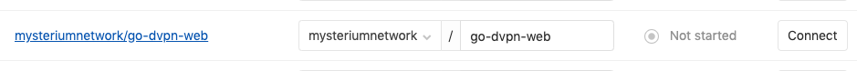

# Continuous Integration

We use pipeline based [Gitlab CI/CD for Github](https://about.gitlab.com/solutions/github/).  
It creates a read-only mirror which is updated upon a push event from Github's webhook.
Pipeline build statuses are reported back to Github.

## How to setup a Gitlab mirror for CI

Github:

1. **IMPORTANT!** Add our team user as a collaborator (write access) to the project (to be able to create webhooks automatically)

Gitlab:

1. Login using team user
2. https://gitlab.com/mysteriumnetwork → `New Project` → `CI/CD for external repo` → `Connect repositories from: Github`
3. Find the project in `From GitHub` column. 
4. **IMPORTANT!** In `To GitLab` column, select `Groups/mysteriumnetwork`.

5. Click `Connect`

That's all.  
If everything went well, Gitlab will mirror updates whenever you push to any branch in Github repo.   
If the project has `.gitlab-ci.yml`, Gitlab will run build pipeline and report build status back to the Github.
